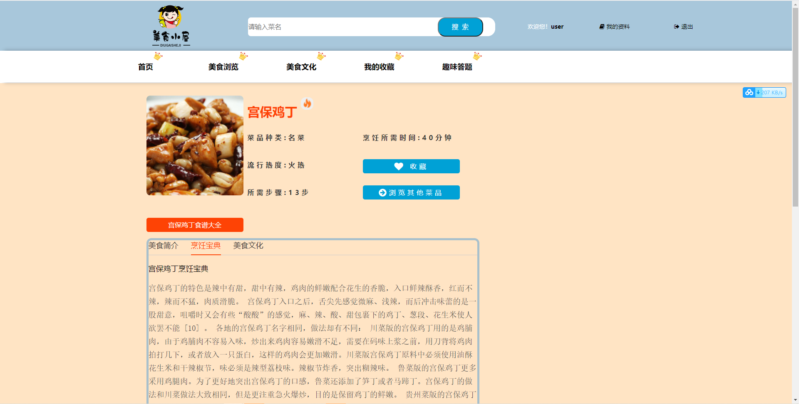
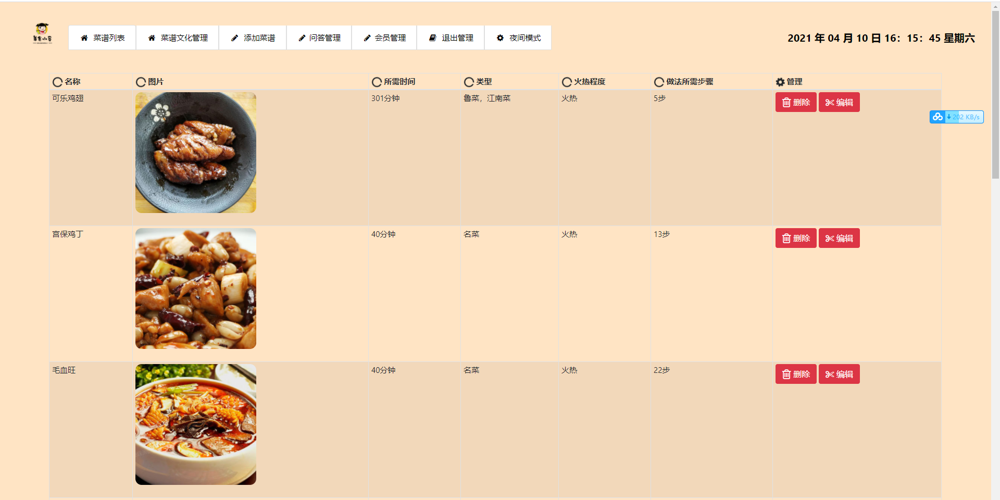

基于Springboot的美食设计网站
=
### 完整代码获取地址：从戎源码网 ([https://armycodes.com/](https://armycodes.com/))
### 作者微信：19941326836  QQ：952045282 
### 承接计算机毕业设计、Java毕业设计、Python毕业设计、深度学习、机器学习
### 选题+开题报告+任务书+程序定制+安装调试+论文+答辩ppt 一条龙服务
### 所有选题地址https://github.com/nature924/allProject

一、项目介绍
---
基于SpringBoot框架的，有用户和管理员两个角色，主要功能如下

### 【前台功能】
1. 首页：展示网站的主要信息和推荐内容。
2. 美食浏览：提供用户浏览各种美食菜品的页面。
3. 美食文化：介绍美食背后的文化历史和相关知识。
4. 我的收藏：用户可以查看和管理自己收藏的美食菜谱。
5. 趣味答题：用户可以参与有趣的美食相关答题活动。

### 【后台功能】
1. 菜谱列表：管理员可以查看和管理网站上发布的菜谱信息。
2. 菜谱文化管理：管理并编辑美食文化相关的内容和资料。
3. 添加菜谱：管理员可以添加新的菜谱信息到网站数据库中。
4. 问答管理：管理美食相关的问答内容，包括审核、编辑和删除等操作。
5. 会员管理：管理网站会员的信息。

二、项目技术
---
- 编程语言：Java
- 数据库：MySQL
- 项目管理工具：Maven
- 前端技术：VUE、HTML、Jquery、Bootstrap
- 后端技术：Spring、SpringMVC、MyBatis

三、运行环境
---
- 操作系统：Windows、macOS都可以
- JDK版本：JDK1.8以上都可以
- 开发工具：IDEA、Ecplise、Myecplise都可以
- 数据库: MySQL5.7以上都可以
- Tomcat：任意版本都可以
- Maven：任意版本都可以

四、运行截图
---
### 论文截图：

### 程序截图：

